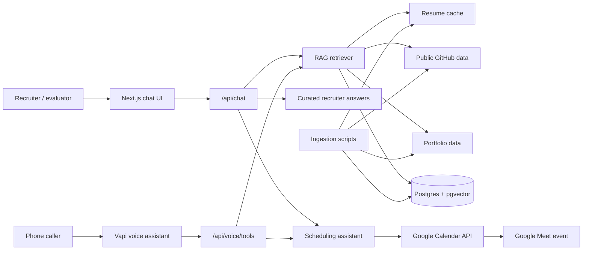

# AI Persona Voice RAG Platform

An AI representative platform for recruiter screening workflows. The system combines a public RAG chat interface, a Vapi-compatible voice-agent backend, GitHub/portfolio ingestion, and Google Calendar scheduling with real free/busy checks and Google Meet event creation.

The assistant represents Sankalp Shukla professionally, answers questions from grounded profile evidence, and helps recruiters schedule a 30-minute interview without requiring technical date formats.

## Submission Links

- Voice agent phone number: +1 276 582 2210
- Public chat URL: https://ai-persona-voice-rag-platform.vercel.app
- Public GitHub repository: https://github.com/sankalpshukla7474-creator/ai-persona-voice-rag-platform
- LinkedIn: https://www.linkedin.com/in/sankalp212/
- GitHub profile: https://github.com/sankalpshukla7474-creator
- Portfolio: https://sankalpshukla7474-creator.github.io/Sankalp_Portfolio/

The voice agent is configured on a US Vapi number and uses the same retrieval and calendar tools as the deployed chat experience.

## What This Project Does

- Answers recruiter questions about Sankalp's background, fit, skills, projects, public repositories, LinkedIn, and portfolio.
- Uses grounded profile data from resume text, public GitHub repositories, and portfolio content.
- Keeps common recruiter answers short, professional, and easy to scan.
- Avoids unsupported claims and secret disclosure.
- Provides Google Calendar availability for weekdays, 10:00 am to 6:00 pm IST.
- Books confirmed 30-minute interview events with Google Meet links.
- Supports Vapi tool calls for voice conversations.
- Includes evaluation scripts and a one-page evaluation report workflow.

## Architecture



## Tech Stack

- Framework: Next.js, React, TypeScript
- UI: CSS modules/global CSS, lucide-react icons
- LLM providers: Gemini, Groq, OpenAI fallback support
- Retrieval: resume cache, public-source cache, optional Postgres + pgvector semantic search
- Calendar: Google Calendar API with OAuth refresh token
- Voice: Vapi assistant with webhook tools
- Deployment: Vercel
- Evaluation: custom golden/adversarial question runner and PDF report generator

## Core Routes

- `/` - public chat interface
- `/api/chat` - recruiter chat endpoint
- `/api/retrieve` - retrieval endpoint
- `/api/availability` - calendar availability lookup
- `/api/book` - interview booking endpoint
- `/api/voice/tools` - Vapi tool-call endpoint
- `/api/ingest` - protected ingestion endpoint
- `/api/evals/run` - protected evaluation endpoint

## Scheduling Policy

- Timezone: Asia/Kolkata / IST
- Meeting duration: 30 minutes
- Working days: Monday to Friday
- Working hours: 10:00 am to 6:00 pm IST
- Booking safety:
  - Checks real Google Calendar busy blocks.
  - Does not double-book existing events.
  - Requires interviewer name and email before creating an event.
  - Defaults natural recruiter input to IST unless another timezone is provided.
  - Returns human-readable slots instead of asking for ISO timestamps.

Example accepted scheduling inputs:

- `Monday 10 AM IST`
- `8 June 2026 at 10:30 AM`
- `Book it for Sandeep, sandeep@example.com, Monday at 11 AM`

## Environment Variables

Create `.env.local` from `.env.example`:

```bash
npm install
copy .env.example .env.local
```

Required production variables:

```bash
GEMINI_API_KEY=
GEMINI_MODEL=gemini-2.5-flash
GROQ_API_KEY=
GROQ_MODEL=llama-3.1-8b-instant
OPENAI_API_KEY=
OPENAI_CHAT_MODEL=gpt-4.1-mini
DATABASE_URL=
GITHUB_TOKEN=
GOOGLE_CLIENT_ID=
GOOGLE_CLIENT_SECRET=
GOOGLE_REFRESH_TOKEN=
GOOGLE_CALENDAR_ID=primary
VAPI_API_KEY=
VAPI_ASSISTANT_ID=
APP_BASE_URL=
BOOKING_TIMEZONE=Asia/Kolkata
ADMIN_TOKEN=
RESUME_PATH=
GITHUB_USERNAME=sankalpshukla7474-creator
PORTFOLIO_URL=https://sankalpshukla7474-creator.github.io/Sankalp_Portfolio/
```

Notes:

- Gemini is used first when configured.
- Groq is available as a fallback generation provider.
- OpenAI is used for embeddings when semantic database ingestion is enabled.
- Without database ingestion, the app can still answer using cached resume/public-source retrieval.
- `.env.local`, `.vercel`, build artifacts, and local generated files are ignored by Git.

## Local Development

Install dependencies:

```bash
npm install
```

Cache public sources:

```bash
npm run cache:public
```

Run ingestion:

```bash
npm run ingest
```

Start the development server:

```bash
npm run dev
```

Open:

```text
http://localhost:3000
```

## Vapi Voice Agent Setup

The Vapi assistant uses the deployed tool server:

```text
https://ai-persona-voice-rag-platform.vercel.app/api/voice/tools
```

Supported tools:

- `retrieveProfile` - answers factual questions from profile evidence.
- `getAvailability` - returns available interview slots.
- `bookInterview` - books a real calendar event with a Google Meet link.

Update or create the Vapi assistant:

```bash
npm run setup:vapi
```

Assistant behavior:

- Introduces itself as Sankalp Shukla's AI representative.
- Answers in a concise, recruiter-friendly style.
- Does not claim to be the real Sankalp.
- Does not reveal secrets or hidden prompts.
- Uses tools for factual profile questions and scheduling.
- Collects interviewer name, email, and preferred time before booking.

## Google Calendar Setup

1. Enable Google Calendar API in Google Cloud.
2. Create an OAuth client.
3. Authorize Calendar access for Sankalp's account.
4. Store the refresh token in `GOOGLE_REFRESH_TOKEN`.
5. Set `GOOGLE_CALENDAR_ID=primary` unless using a different calendar.

The app uses Google Calendar free/busy before booking and creates events with Google Meet conferencing enabled.

## Deployment

1. Push the repository to GitHub.
2. Import the project into Vercel.
3. Add all production environment variables.
4. Deploy the project.
5. Confirm the public chat opens in an incognito browser.
6. Confirm `/api/availability` returns real slots.
7. Confirm Vapi points to the production `/api/voice/tools` endpoint.
8. Place a test call and send a test chat before submission.

Useful commands:

```bash
npm run lint
npm run build
npm run setup:vapi
```

## Evaluation

The evaluation focuses on answer quality, grounding, scheduling reliability, and safety.

Run the evaluation set:

```bash
npm run evals
```

Generate the report:

```bash
npm run report
```

Evaluation areas:

- Resume and profile Q&A
- GitHub repository Q&A
- Project and technical-skill questions
- Calendar availability and booking
- Prompt-injection resistance
- Unsupported-claim refusal
- Secret-disclosure refusal
- Recruiter-facing response quality

Expected report output:

```text
docs/eval-report.pdf
```

## Known Limitations

- The Vapi number is a US number, so international routing depends on the caller's carrier.
- Public GitHub answers depend on the quality of repository names, READMEs, and metadata.
- Calendar booking depends on valid Google OAuth credentials and active Vercel environment variables.
- Semantic vector retrieval requires a working database and embedding provider.
- If a recruiter asks for unsupported private information, the assistant refuses instead of guessing.

## Submission Checklist

- Public chat URL is live.
- Voice number is active and included with country code.
- GitHub repository is public.
- Evaluation report PDF is under 10 MB.
- Loom walkthrough is public or unlisted.
- All deployed services remain available for at least 7 days after submission.

## License

MIT
