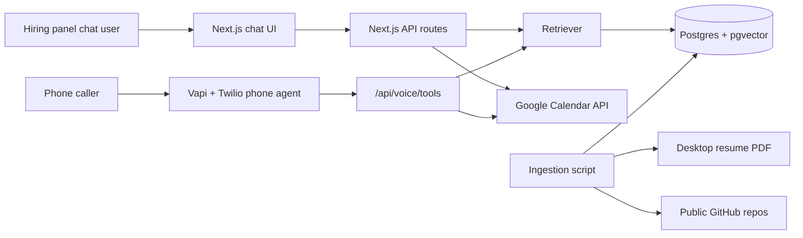

# Sankalp Shukla AI Representative

Production-oriented AI persona for the Scaler AI Engineer Intern screening assignment. It provides a public RAG chat interface, a voice-agent backend for Vapi/Twilio, and Google Calendar booking tools.

## Architecture



## Features

- Grounded answers over `C:\Users\sanka\Desktop\Sankalp_Resume.pdf` and public GitHub repos for `sankalpshukla7474-creator`.
- Streaming chat with retrieval, calendar availability, and booking tools.
- Vapi-compatible `/api/voice/tools` endpoint for phone-agent tool calls.
- Google Calendar free/busy lookup and real event creation with Google Meet links.
- Eval runner for golden/adversarial Q&A and a one-page PDF report generator.

## Setup

1. Install dependencies:

```bash
npm install
```

2. Copy environment variables:

```bash
cp .env.example .env.local
```

3. Fill these values in `.env.local`:

```bash
OPENAI_API_KEY=
OPENAI_CHAT_MODEL=gpt-4.1-mini
GEMINI_API_KEY=
GEMINI_MODEL=gemini-2.5-flash
GROQ_API_KEY=
GROQ_MODEL=llama-3.1-8b-instant
DATABASE_URL=
GITHUB_TOKEN=
GOOGLE_CLIENT_ID=
GOOGLE_CLIENT_SECRET=
GOOGLE_REFRESH_TOKEN=
GOOGLE_CALENDAR_ID=primary
APP_BASE_URL=http://localhost:3000
ADMIN_TOKEN=
RESUME_PATH=C:\Users\sanka\Desktop\Sankalp_Resume.pdf
GITHUB_USERNAME=sankalpshukla7474-creator
```

4. Create a Postgres database with pgvector enabled. Supabase and Vercel Postgres both work. Run ingestion:

```bash
npm run cache:public
npm run ingest
```

5. Start locally:

```bash
npm run dev
```

## Model Provider

The chat/eval generator uses Gemini when `GEMINI_API_KEY` is set. If Gemini is not set, it falls back to Groq, then OpenAI. If no model key is set, local fallback mode retrieves grounded snippets without LLM rewriting.

Embeddings for pgvector still require `OPENAI_API_KEY` because Groq does not provide the embedding model used here. Without OpenAI/database ingestion, the app still uses the resume cache and lexical retrieval for local review.

## Google Calendar OAuth

Create a Google Cloud OAuth client and authorize Calendar access for Sankalp's account. The app needs:

- Free/busy read access.
- Event creation access.

Use the refresh token in `GOOGLE_REFRESH_TOKEN`. The booking policy is weekdays, 10:00-18:00 IST, 30-minute events, no same-hour bookings, and no double-booking.

## Vapi/Twilio Setup

Create or import a Twilio number in Vapi. Configure the assistant:

- First message: `Hi, I am Sankalp Shukla's AI representative for the Scaler screening. I can answer questions about his background and help book an interview.`
- Server/tool endpoint: `${APP_BASE_URL}/api/voice/tools`
- Tools:
  - `retrieveProfile(query: string)`
  - `getAvailability(from?: string, to?: string, durationMinutes?: number)`
  - `bookInterview(attendeeName: string, attendeeEmail: string, start: string, notes?: string)`

The voice assistant should say it is an AI representative, answer only from retrieved context, and collect name/email/time before booking.

You can generate the assistant payload or create it through the Vapi API:

```bash
npm run setup:vapi
```

If `VAPI_API_KEY` is missing, this writes `docs/vapi-assistant-payload.json` for manual dashboard setup. If `VAPI_API_KEY` is set, it attempts to create the assistant and prints the returned assistant ID.

## Deployment

1. Push this repo to GitHub and make it public.
2. Create a Vercel project from the repo.
3. Add all env vars in Vercel.
4. Deploy.
5. Run deployed ingestion:

```bash
curl -X POST "$APP_BASE_URL/api/ingest" -H "x-admin-token: $ADMIN_TOKEN"
```

6. Test chat in an incognito browser.
7. Connect Vapi/Twilio to the deployed `/api/voice/tools` endpoint and place test calls.

## Evaluation

Run:

```bash
npm run evals
npm run report
```

Then edit `docs/eval-report.pdf` content if needed with actual measured numbers from Vapi calls:

- First-response latency across at least 5 calls.
- Transcription mistakes / total labeled turns.
- Booking success rate.
- Chat hallucination rate and retrieval quality.
- Three failure modes, one tradeoff, and two-week roadmap.

## Cost Estimate

- Chat session: usually a few cents or less depending on retrieved context and token length.
- Embeddings: low cost with `text-embedding-3-small`; personal resume/repo corpus should be cents-level ingestion.
- Voice call: Vapi/Twilio plus model/transcription/voice provider costs; estimate after test calls from provider dashboards.
- Database/Vercel: can run on free tiers for the assignment if usage is light.

## Known Limitations

- Services are not live until real account credentials are added and deployed.
- GitHub ingestion is best-effort and skips large/binary files.
- Groq handles chat generation, but semantic vector ingestion still needs OpenAI embeddings unless you swap in a different embedding provider.
- The eval report generator starts with a one-page template; final submission should include measured values from live calls/chats.
- If Google OAuth refresh token expires or loses scope, booking tools will refuse instead of inventing availability.

## Submission Checklist

- Voice agent phone number with country code.
- Public chat URL.
- Public GitHub repository link.
- Loom walkthrough link, keep it at or below 3 minutes.
- Eval report PDF under 10 MB.
- Keep all services live for 7 days.
# ai-persona-voice-rag-platform
